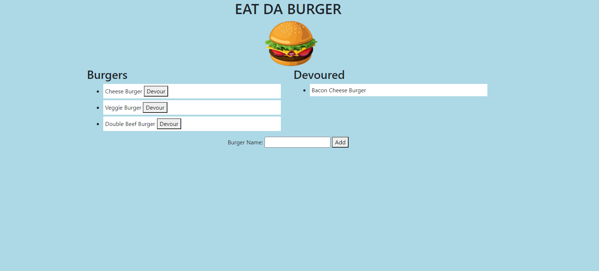

# Burger App

- [Description](#Description)
- [Installation](#Installation)
- [License](#License)
- [Developer](#Developer)
- [Questions](#Questions)
- [Link](#link)
- [Visual](#Visual)

## Description
This is a burger app, meant to keep track of all the different burgers you have tried.  
Its kind of like a bucket list for burgers.

## Installation
Must have node, mysql, and handlebars.  
Run the following:  
npm install  
npm install express  
npm install express-handlebars  
npm install mysql  

## Usage
You can add a burger, which will dynamically create it and add it to the uneaten list.  
Once you click devour it will switch it to the devoured list. 

## License

## Developer
Henry

## Questions
[Github Profile](https://github.com/HenryP23)  
You can contact me through my email henryhparrish@gmail.com
## Link

## Visual
https://agile-ocean-80125.herokuapp.com/
